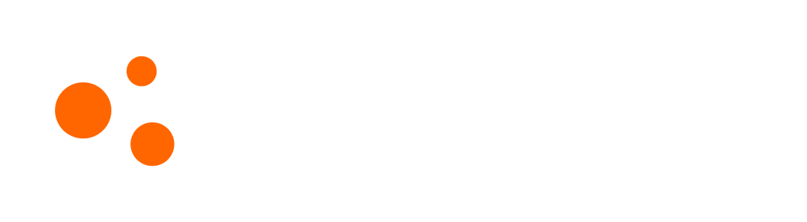

<p align="center">
  <a href="https://beamng.com/tech/">
    
  </a>
</p>

---

# BeamNG Self-Driving Agent

> CS450-01 Final Project — PyTorch behavior cloning + experimental REINFORCE fine-tuning in BeamNG.tech

---

## Overview

This project builds a self-driving car agent for the BeamNG.tech simulator. A small feedforward neural network learns to predict steering, throttle, and brake from road sensor and electrics data. The main pipeline uses supervised behavior cloning. An experimental reinforcement-learning extension fine-tunes the trained model using a REINFORCE-style policy-gradient loop.

**Tech stack:** Python 3.10+ (3.13.7 recommended), PyTorch, BeamNGpy, Hirochi Raceway (BeamNG.tech)

**State vector:** `[distFromCenter, headingAngle, curvature, roadWidth, drivability, Speed]`

**Action vector:** `[Steering, Throttle, Brake]`

---

## Requirements

- Python 3.10+ (3.13.7 recommended)
- BeamNG.tech — available for Windows (experimentally on Linux) at [beamng.com/tech](https://beamng.com/tech/); a license is required

---

## Installation

```bash
python -m pip install --upgrade pip
python -m pip install -r requirements.txt
python -m pip install torch torchvision scikit-learn tqdm plotly jupyter
```

If BeamNGpy is missing:

```bash
python -m pip install beamngpy==1.35
```

---

## Pipeline

### Step 1 — Collect training data

```bash
python collect_data.py --beamng-home "C:/BeamNG.tech.v0.38.5.0" --frames 200
```

The BeamNG AI drives Hirochi Raceway while road sensor and electrics data are logged.

| Argument | Default | Description |
|---|---|---|
| `--beamng-home` | *(required)* | Path to BeamNG.tech install folder |
| `--frames` | `30` | Number of frames to collect |
| `--with-obstacles` | off | Add obstacle cars to the scenario |
| `--startup-delay` | `8.0` | Seconds to wait before first sensor poll |
| `--warmup-polls` | `10` | Warmup polls before the capture loop |
| `--ai-mode` | `span` | BeamNG AI mode: `span`, `traffic`, `random` |
| `--keep-open` | off | Wait for Enter before disconnecting |

Output: `raw_data.csv`

Row format:
```
distFromCenter, headingAngle, curvature, roadWidth, drivability,
Speed, Steering, Throttle, Brake
```

---

### Step 2 — Process the data

```bash
python process_data.py
```

Optional explicit paths:

```bash
python process_data.py --input raw_data.csv --output processed_data.csv
```

Validates the CSV schema, drops rows with missing values, clips impossible control values.

Output: `processed_data.csv`

---

### Step 3 — Train the behavior-cloning model

```bash
jupyter notebook training_loop.ipynb
```

Trains `DrivingModel` (6 → 64 → 32 → 3 feedforward network) using MSE loss on recorded controls. Uses an 80/10/10 train/val/test split with early stopping.

Output: `best_model.pth`

---

### Step 4 — Run the agent in BeamNG

Edit `config.json` to point to your BeamNG installation and model:

```json
{
  "beamng-path": "C:/BeamNG.tech.v0.38.5.0",
  "model-path": "best_model.pth"
}
```

Then run:

```bash
python agent.py
```

The agent loads the trained model, initializes BeamNG, and drives in a continuous loop using live sensor data.

---

## Experimental Reinforcement Learning Extension

After behavior cloning, the RL extension lets the agent improve by acting in BeamNG and learning from reward feedback — useful for recovering from states not covered by the training dataset.

### Run RL fine-tuning

```bash
python rl_agent.py
```

Optional arguments:

```bash
python rl_agent.py --config config.json
python rl_agent.py --beamng-home "C:/BeamNG.tech.v0.38.5.0"
```

### Algorithm (REINFORCE)

1. Load `best_model.pth` as the starting policy.
2. Wrap the deterministic model as a stochastic Gaussian policy.
3. Run BeamNG driving episodes.
4. Sample actions and record their log probabilities.
5. Compute rewards via `rl_reward.py`.
6. Compute discounted returns (γ = 0.99).
7. Update policy weights with loss = −log_prob × return.
8. Save the best episode model as `best_model_rl.pth`.

### Reward design

| Signal | Effect |
|---|---|
| `speed × cos(headingAngle)` | Rewards forward progress aligned with the road |
| Distance from centerline | Penalty proportional to lane offset |
| Curvature × speed | Penalty for going fast through sharp turns |
| Throttle/brake conflict | Penalty for pressing both simultaneously |
| Steering magnitude | Small smoothness penalty |
| Off-road / non-drivable | Large penalty + episode termination |
| Stopped (speed < 0.5 m/s) | Small penalty, episode continues |

Output: `best_model_rl.pth`

> **Note:** REINFORCE is a high-variance Monte Carlo algorithm and training is slow — limited data means the agent can take several minutes of wall time per behavior learned (e.g. ~6 minutes to learn not to immediately turn into a wall at the start). Improvement is real but incremental: the agent will learn to handle the states it encounters most, but will go off-road further down the track until given more episodes and data. Treat `best_model_rl.pth` as a work-in-progress candidate rather than a complete replacement for `best_model.pth`.

To test the RL model, update `config.json`:

```json
"model-path": "best_model_rl.pth"
```

---

## BeamNG-Free Reward Demo

To verify the reward function without BeamNG running:

```bash
python demo_rl_reward.py
```

Prints reward values for hand-written cases: centered, near road edge, too fast in a curve, stopped, and off-road.

---

## File Reference

| File | Purpose |
|---|---|
| `collect_data.py` | Runs BeamNG AI and records road/electrics data to `raw_data.csv` |
| `process_data.py` | Cleans and validates `raw_data.csv`, writes `processed_data.csv` |
| `training_loop.ipynb` | Trains the supervised behavior-cloning model |
| `model.py` | Defines `DrivingModel`, the PyTorch neural network |
| `utils.py` | PyTorch `Dataset` wrapper for driving rows |
| `state_schema.py` | Shared state/action schema and sensor conversion helpers |
| `agent.py` | Runs a trained model live in BeamNG |
| `rl_reward.py` | Shared RL reward function used by training and demo |
| `rl_agent.py` | Experimental REINFORCE fine-tuning loop |
| `demo_rl_reward.py` | BeamNG-free reward function demonstration |
| `environment_task_setup.py` | Scenario layout, spawn positions, and obstacle setup |
| `dummynet.py` | Dummy network for testing the control pipeline without a trained model |
| `config.json` | BeamNG path, scenario settings, and model path |

---

## Outputs

| File | Created by | Description |
|---|---|---|
| `raw_data.csv` | `collect_data.py` | Raw BeamNG driving dataset |
| `processed_data.csv` | `process_data.py` | Cleaned dataset for training |
| `best_model.pth` | `training_loop.ipynb` | Supervised behavior-cloning model |
| `best_model_rl.pth` | `rl_agent.py` | Experimental RL fine-tuned candidate model |

---

## Common Errors

**`No module named beamngpy`**
```bash
python -m pip install beamngpy==1.35
```

**`No BeamNG binary found in BeamNG home`**

Your `--beamng-home` path is wrong. It must point to the BeamNG.tech install root containing one of:
```
BeamNG.tech.exe
Bin64/BeamNG.tech.x64.exe
```

**`raw_data.csv` is missing columns**

Collect data using the current `collect_data.py`. Expected columns:
```
distFromCenter, headingAngle, curvature, roadWidth, drivability,
Speed, Steering, Throttle, Brake
```

**RL training is very slow**

This is expected. Improvement is real but incremental — the agent learns to handle states it encounters frequently, but with limited training data it can take several minutes per behavior learned. Running more episodes and collecting more driving data will extend how far down the track the agent can drive reliably. For a quick demo, `best_model.pth` from behavior cloning is the faster path.

---

## Contributions

| Member | Contributions |
|---|---|
| Matthew Gallenberger | `collect_data.py`, `process_data.py`, `state_schema.py` |
| Brendel Zuniga | `training_loop.ipynb`, `rl_agent.py`, `state_schema.py` |
| Gregory Larson | `agent.py`, `dummynet.py`, `state_schema.py` |
| Santiago Ramirez | `model.py` |
| Nathan Fermo | `environment_task_setup.py` |
| Tanuj Reddy Thummala | `training_loop.ipynb`,`rl_agent.py`, `rl_reward.py`, `demo_rl_reward.py`, `state_schema.py` |

Additional contributions are noted in the headers of each source file.

---

## License & Trademark

**BeamNG.tech** is developed and published by BeamNG GmbH. Use of BeamNG.tech requires a valid license obtained from [beamng.com/tech](https://beamng.com/tech/).

The BeamNG.tech name and logo are registered trademarks of BeamNG GmbH. The logo used in this README is reproduced in accordance with the [BeamNG Trademark Usage Guidelines](https://beamng.com/game/support/policies/trademark-guidelines/). The logo has not been altered in any way other than scaling.

This project is an independent academic work and is not affiliated with, endorsed by, or sponsored by BeamNG GmbH.